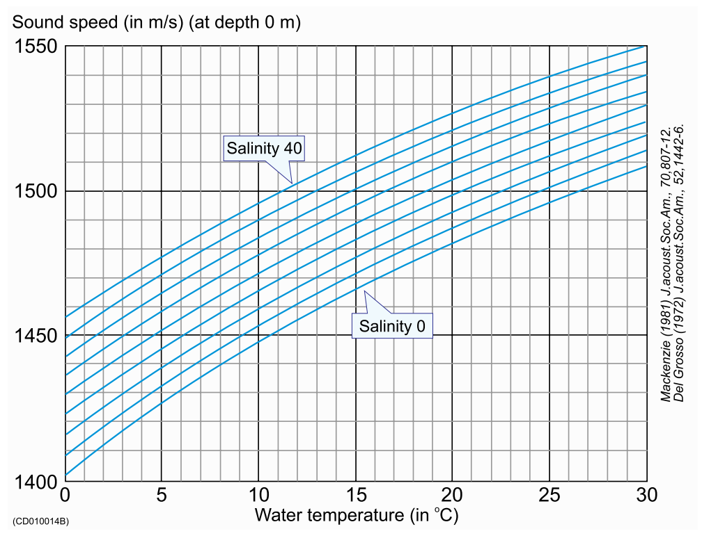
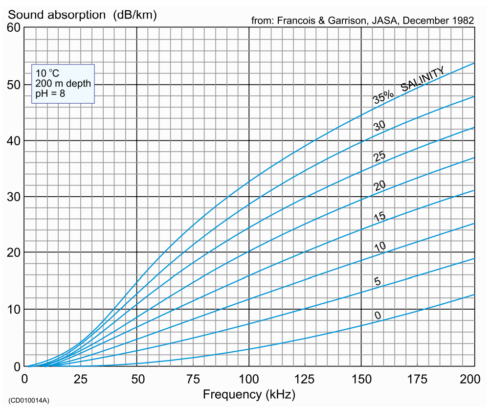
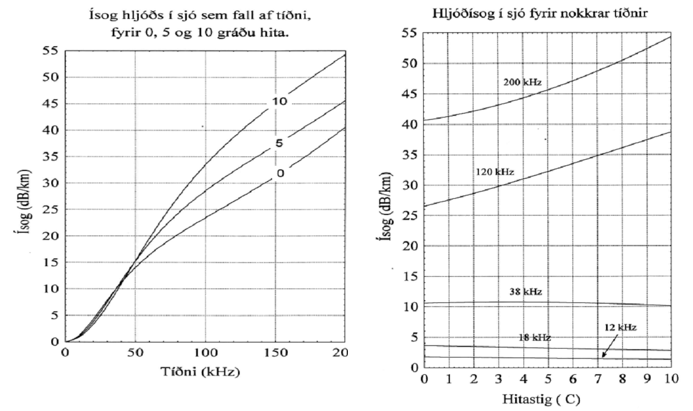

# Viðauki A

Viðauki við handbók bergmálsmælinga

## Hljóðhraði og gleypni í sjó

Það er ómaksins vert að kynna nánar hvernig hljóðhraði og gleypni,
einnig kallað ísog, hafa áhrif á hljóðendurvörp í sjó. Hljóðhraðinn
ræður auðvitað ferðahraða hljóðbylgjunnar og sé hann vel þekktur, með
fráviki innan við u.þ.b. ±5-10 m/sek, má reikna fjarlægð eða dýpi á
þeim hlut frá hljóðgjafa sem endurkastaði hljóðinu með töluverðri
nákvæmni (0.7 - 1.4%).

Í ER60 Reference Manual á bls 39 og 40 eru línurit sem sýna
breytileika hljóðhraða með hita og seltu og breytileika gleypni eftir
tíðni og seltu. Takið eftir hversu gleypnin er tíðni- og seltuháð.

(ref:cap-hradi) Hljóðhraði sem fall af tíðni við mismunandi seltustig. Tekið úr [handbók Simrad EK60](https://www.simrad.com/www/01/NOKBG0397.nsf/AllWeb/F2AB311B3F6E6B15C1257106003E0806/$file/164692ad_ek60_reference_manual_english_lores.pdf?OpenElement).

```{r, fig.cap='(ref:cap-hradi)',out.width='100%',fig.align='center',echo = FALSE}

```

(ref:cap-gleyp1) Skalinn hér fyrir gleypni (absorbtion) er lógariþmískur og gefin upp í decibelum pr kílómetra (dB/km), sem þýðir að fyrir hvert stökk upp um 10 á þessum skala verður tíföldun í orkutapi. Tekið úr [handbók Simrad EK60](https://www.simrad.com/www/01/NOKBG0397.nsf/AllWeb/F2AB311B3F6E6B15C1257106003E0806/$file/164692ad_ek60_reference_manual_english_lores.pdf?OpenElement).
 
```{r fig.cap='(ref:cap-gleyp1)',out.width='100%',fig.align='center',echo = FALSE}

```

Það má ráða af fyrstu myndinni að hljóðhraði í sjó hér við land er
yfirleitt á bilinu 1460-1490 m/s. Sé hljóðhraðinn langt frá raungildi
fást ekki réttar upplýsingar um dýpi á torfum eða botni. Á annarri
myndinni sést að selta og hiti hefur afgerandi áhrif á gleypni,
þ.e. tap hljóðorkunnar í varma til umhverfisins. Tíðni hljóðsins
skiptir einnig verulegu máli. Á lægri tíðnunum, 18 og 38 kílóriðum, er
breytileiki gleypninnar eftir seltu og hita sáralítill, en er
töluverður á þeim hærri, 120 og 200 kílóriðum. Það getur því skipt
töluverðu máli að taka tillit til þessa við mælingar og úrvinnslu
bergmálsgagna á hærri tíðnunum.

(ref:cap-gleyp2) Þessi línurit sýna hvernig gleypnin, (hér nefnt ísog) eykst með sjávarhita (selta um 35%%) og tíðni hljóðsins. Auðsætt er af þessu síðasta línuriti að gleypnin á 18 og 38 kílóriðum breytist sáralítið með hita. Um 120 og 200 kílórið gegnir öðru máli.  Til þess að áætla orkutapið í decibelum má nota Tap=2R*$\alpha$, þar sem R er dýpið á endurvarpinu og $\alpha$ er gleypnin. 


```{r gleyp,fig.cap='(ref:cap-gleyp2)',out.width='100%',fig.align='center',echo=FALSE}

```

Í EK60 mælunum er endurvarpsstyrkurinn leiðréttur m.t.t. dýpis og
gleypni. Fyrir allar tíðnir gildir að á vegferð sinni frá botnstykkinu
dreifir hljóðið sér um kúluflöt, þannig að hljóðstyrkurinn undir
skipinu minnkar með fjarlægðinni í öðru veldi. Það sama á sér stað
þegar endurvarpið af “fiskinum” kastast upp að
botnstykkinu. Varmatapið minnkar hins vegar hljóðstyrkinn jafnt og
þétt, en er hins vegar mjög háð seltu, hita og tíðni. Hversu góð þessi
dýpisháða leiðrétting er í mælunum ræðst af því hvort upplýsingarnar
sem unnið er út frá séu nálægt lagi. Þessi dýpisháða leiðrétting á
endurvarpinu er gjarnan skammstöfuð TVG, sem stendur fyrir “time
varied gain”.

Sé hljóðhraðinn réttur sem reiknað er með í mælinum fáum við alla vega
réttar dýpisupplýsingar. Ekki er þar með sagt að styrkur merkisins sé
réttur nema því aðeins að gleypnin sé rétt. Tökum sem dæmi mælingar á
120 kílóriðum, þar sem sjávarhiti sé um 5 gráður og lóðningarnar á 100
metra dýpi. Hljóðhraðinn er þá um 1470 m/s og gleypnin 32.1 dB/km. Sé
mælirinn stilltur á hljóðhraða við 10 gráður, (þ.e. um 1490 m/s), þá
er reiknuð gleypni áætluð 38.6 dB/km. Munurinn í áætluðu og réttu tapi
miðað við þessar umhverfisaðstæður er þá 2*0.1*(alfa(10°C)- alfa(5°C))=1.3
dB. Umreiknað í hlutfall er það 1.35, sem þýðir að mælirinn gefur
merkið of sterkt sem þessu hlutfalli nemur, sem er engan veginn
viðunandi.

Línuritið yfir gleypnina skýrir hvers vegna háar tíðnir henta illa
fyrir mælingar í sjó á miklu dýpi, þar sem gleypnin getur orðið það
mikið að hlutfall endurvarps og hins eilífa suðs verður of lágt.

Mörg rit eru til um neðansjávarhljóð og það má benda á eitt af
fjölritum Hafró, þar sem lýst er grundvallaratriðum í þeim mælingum
sem við stundum með bergmálsmælingum. Fjölrit 26, Mælingar á stærð
loðnustofnsins 1978-1991. Aðferðir og niðurstöður. Reykjavík 1991,
eftir Pál Reynisson og Hjálmar Vilhjálmsson. Mjög gagnleg bók fyrir
lengra komna er “Fisheries Acoustics” eftir E.J. Simmonds og
D.N. MacLennan (2005). Í henni er fjallað á aðgengilegan hátt um flest
sem lýtur að bergmálsmælingum á fiski.

Jöfnu sem gefur góða nálgun hljóðhraða í sjó sem fall af hita, seltu
og dýpi má finna í grein Mackenzie, K. V., ”Nine term equation for
sound speed in the oceans (JASA, 70(3), sept 1981). Nálgunarjöfnu
fyrir gleypni finnst m.a. í grein Francois og Garrison, ”Sound
absorbtion based on ocean measurements: Part I: Pure water and
magnesium sulfate contributions”, (JASA 72(3) sept 1982). Sjá einnig
þessar hentugu vefsíður fyrir reikninga á gleypni og hljóðhraða:
http://resource.npl.co.uk/acoustics/techguides/seaabsorption/ og
http://www.tsuchiya2.org/soundspeed/index.html

## Mælitækin

Áreiðanleiki bergmálsgagna sem nota skal til reikninga á stofnstærð
fiskistofna er m.a. undir því kominn að góð og stöðug mælitæki séu
notuð. Ekki er síður mikilvægt að úrvinnsluhugbúnaður sé
pottþéttur. Mælingarnar geta tekið fleiri vikur úti á sjó og frávik í
næmni bergmálstækjanna geta haft talsverð áhrif á mæligildi og þar með
niðurstöður. Næmni mælanna og langtímastöðugleiki verður því að vera
undir stöðugu eftirliti og allar aðstæður sem geta haft áhrif á
niðurstöðuna þurfa að vera vel skjalfestar.

### Bilun í mælitækjum

Þó sjaldgæft sé að bergmálsmælar okkar bili alvarlega getur þó sú
staða komið upp. Þær rásir sem eru í nútímabergmálsmælum eru það
flóknar að það tæplega nema á færi framleiðanda að gera við. Oftast
mun það þó felast í að skipta út prentrásarbretti. Viðbúnaður Hafró
við slíkum uppákomum er enginn. Varahlutir í E60-mælanna eru engir til
og oft er enginn tæknimaður um borð. Þetta getur verið bagalegt og
getur kostað langa siglingu í land. Sú reynsla sem við höfum af þeim
mælum sem við notum (EK500, EK60) hefur þó verið mjög góð og
bilanatíðni afar lág. Smávægilega hiksta í keyrslu mælanna hefur oft
tekist að leysa með símtali við vanan mann á Tæknideild.

### Kvörðun bergmálsmæla

Til eru handbók um kvörðun bergmálsmæla (ICES Cooperative Research
report 144, 1987 – Calibration of acoustic instruments for fish
density estimation: A practical guide). Margt í þeirri bók er að
nokkru leyti orðið úrelt, enda m.a. stíluð upp á kvörðun EK400 mælanna
frá Simrad. Árið 1991 var ný kynslóð rannsóknamæla frá Simrad, EK500,
sett í rannsóknaskip okkar. Þar var stafræn tækni notuð mun meira en
áður. Frá því um 2004 tókum við í notkun enn nýja kynslóð mæla, EK60,
og höfum notað fram til dagsins í dag (2013). Þar er nánast öll
meðhöndlun merkisins eftir vissa formögnun á stafrænu formi. Meðal
annars er kvörðunarmódúll í EK60 hugbúnaðinum (ER60) sem býður upp á
einfalda meðhöndlun kvörðunargagna í rauntíma. Í “Reference Manual,
Simrad ER60” er ágæt lýsing á því hvernig hann er notaður.  Við góðar
aðstæður þar sem ekki er truflun frá fiski má vel styðjast við þess
aðferð eingöngu.  Í okkar kvörðunum hafa þó gögnin yfirleitt verið
meðhöndluð mun ítarlegar, t.d með Echoview að hluta og viðeigandi
tölfræðilegar nálganir síðan gerðar í þar til gerðum forritum
(t.d. Mathcad, R eða annað) til þess að meta stuðla.  Í smíðum er ný
yfirgripsmikil kvörðunarhandbók sem eingöngu snýr að EK60-mælunum.
Þessi handbók er samin af mörgum vísinda- og tæknimönnum sem starfa
innan ICES og mun vonandi koma út 2014.

### Millikvörðun

Lýsing á millikvörðun tveggja skipa er meðal annars lýst í ICES
Cooperative Research report 144, 1987 – Calibration of acoustic
instruments for fish density estimation: A practical guide.  Svipaða
lýsingu má sjá í bók þeirra Simmonds og MacLennan, Fisheries
Acoustics, theory and practice, Blackwell 2005. Samanburður
bergmálsmæla milli skipa kemur ekki í stað venjulegrar kvörðunar
þeirra, en gefur vísbendingar um að eitthvað sé að ef mikill munur
fæst milli skipanna.
