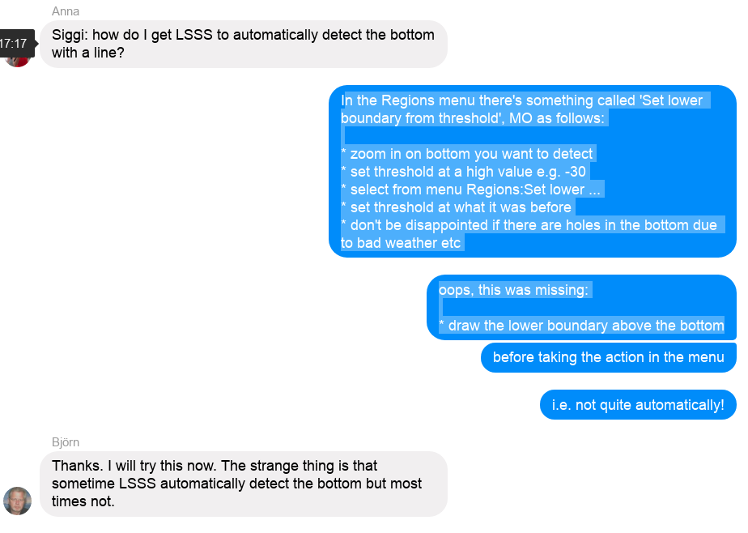

# Appendix C LSSS bits and pieces

In the following preliminary LSSS-protocols to follow on Hafró surveys
will be established and a few 'how-to-s' on LSSS use will be given.

## How-to 1: Bottom detection 

The program doesn't always detetect bottom automatically when files are opened, depends on whether or not 'Pelagic Mode' is being used. If it is desired to detect the bottom aferwards, a 'how-to' is given in Figure \@ref(fig:bot-det).  

```{r bot-det, fig.cap="Bottom detection in LSSS as given in FB-chat during January 2018 capelin survey", fig.lab="bot_det"}

```

## How-to 2: Survey backup

During a survey it is possible to keep a sync-ed backup of the data
and survey work on an external disk and finish of the backup
incrementally at the end of the survey in a shorter period of time
than if you'd have to back-up the whole thing. The settings and
procedure is as follows.

- Before we start go to `LSSS:Config/Edit survey`, under `Application
  configuration:Directories:Default Directories` check to see if
  variables `SurveyDirStructur` and `BackupDirStructure` are set as
  `default`. If not, change from `imr` to `default` with `AccessLevel`
  set as `Administrator`. Directory structure we get with `imr` is
  unneccessarily complicated.

- Check the disk use of the survey data folder (with raw-files) and
  especially in the case of Korona-postprocessing the LSSS-survey
  folder (usually under C:\LSSS_DATA on a Windows machine), and if
  there is space on with the external disk to be used.

- Connect the disk, create directory `LSSS_DATA` on the root of the
  disk if not already there, _e.g._ `G:\LSSS_DATA`. Also create a
  folder with the exact same name as in use for the LSSS-survey folder
  under `C:\LSSS_DATA`. I know this is a bit awkwards, but this has
  worked for me.

- In LSSS go to menu `File:Backup Survey Data` and teh choose `Select
  output directory` and point and click to the survey folder in the
  LSSS_Data on the external disk.

- When you are sure that the correct folders are selected as source
  and destination, click the `Copy current survey` button.

- Final step, check to see that the back-up took place and the latest changes are reflected.

- Repeat the last two steps as necessary during the survey.

At the end of the survey, be sure to finish interpretation / scrutiny,
save to database, generate the necessary report tables and export the
database for the current survey before final back-up.

The back-up works by copying the survey folder under LSSS_DATA and
also folders that are referred to in the survey settings. EK60-files
on a shared folder on the echosounder computer are thus 'sucked in' to
the back-up, the same would apply to _e.g._ cnv-versions of CTD-casts
that we could create routinely in SeaBird post-processing made
accessible in a share or on a net-drive.
